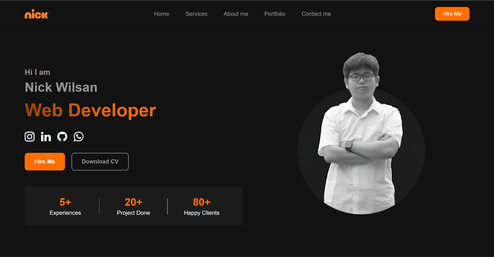

# Nick Wilsan - Personal Portfolio Website



A modern, responsive personal portfolio website built using pure HTML and CSS. This website serves as an online portfolio to showcase my skills, projects, and services as a web developer.

<div align="center">

[](https://www.instagram.com/wilsan_nick._/)
[](https://www.linkedin.com/in/nick-wilsan-127623322/)
[](https://github.com/Nick-Wilsan)
[](http://wa.me/6281249730818)

</div>

## Features

- **Fully Responsive Design**: Works flawlessly on mobile, tablet, and desktop
- **Modern UI/UX**: Clean aesthetics with gradient accents and smooth animations
- **Interactive Elements**: Smooth scrolling, hover effects, and mobile-friendly navigation
- **Five Key Sections**:
  - Home/Hero with social links
  - Services showcase
  - About Me with skills progress bars
  - Portfolio gallery
  - Contact form with validation

## Technologies Used

- HTML5
- CSS3 (Flexbox, Grid, animations)
- Font Awesome Icons
- Bootstrap Icons
- Vanilla JavaScript (for mobile menu and smooth scrolling)

## How to Run

1. Clone the repository:
```bash
git clone https://github.com/Nick-Wilsan/Personal-Website.git
